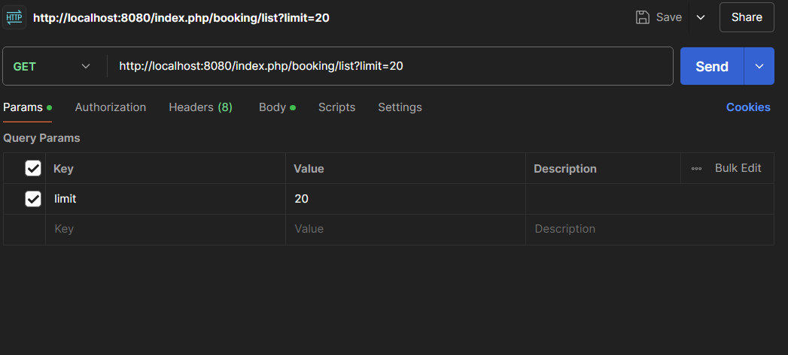
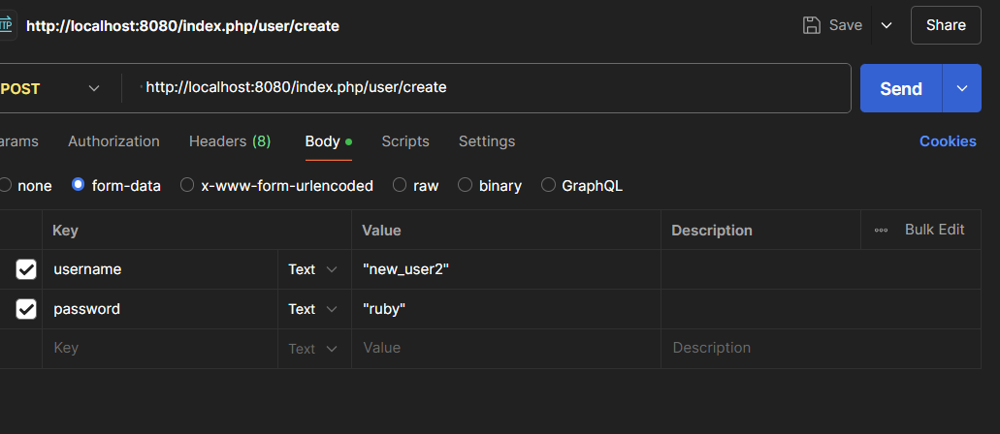
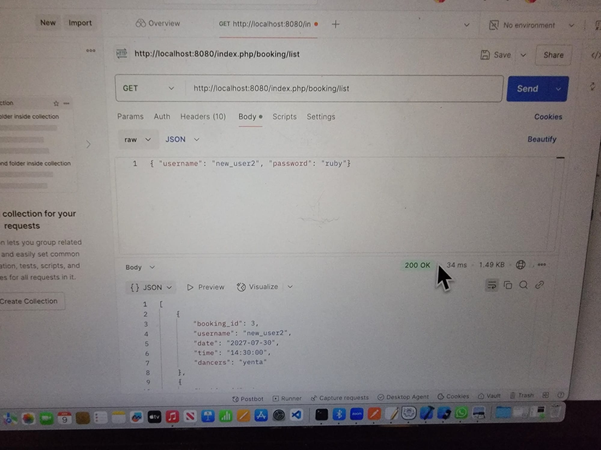
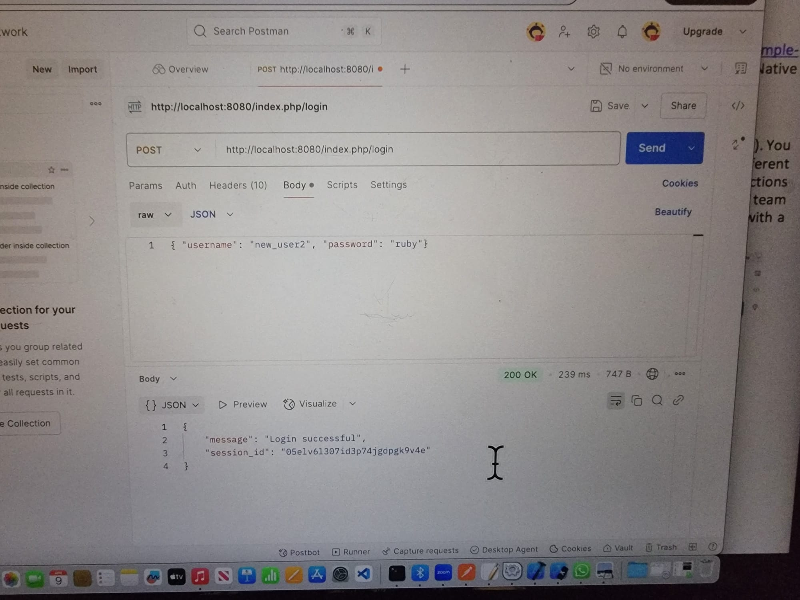
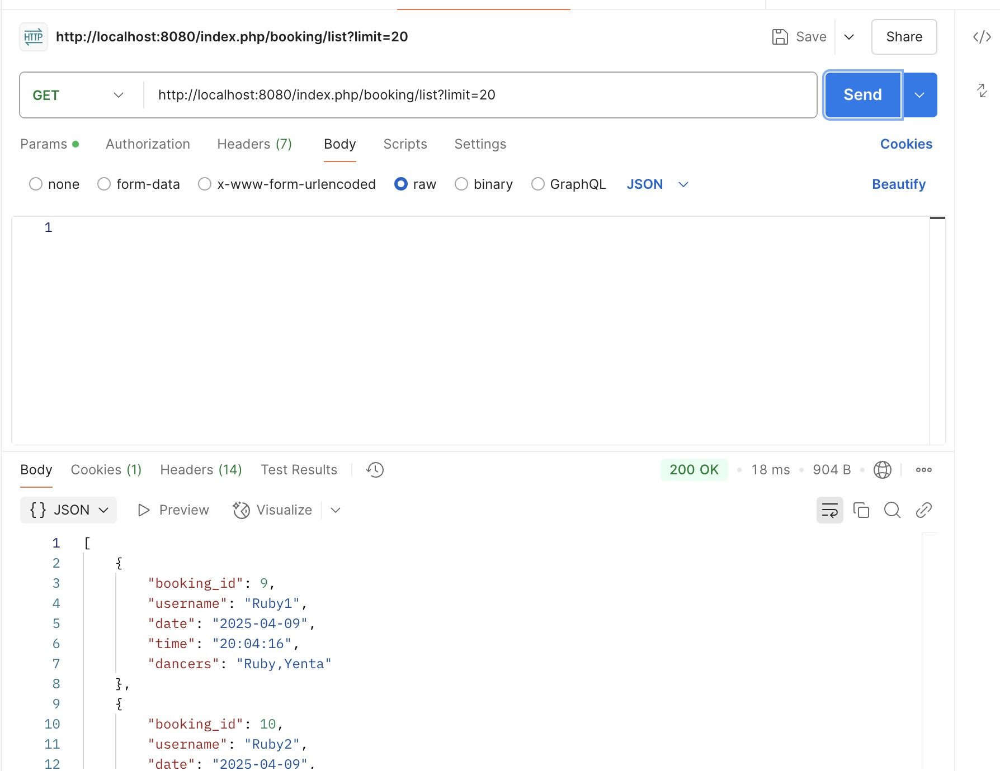
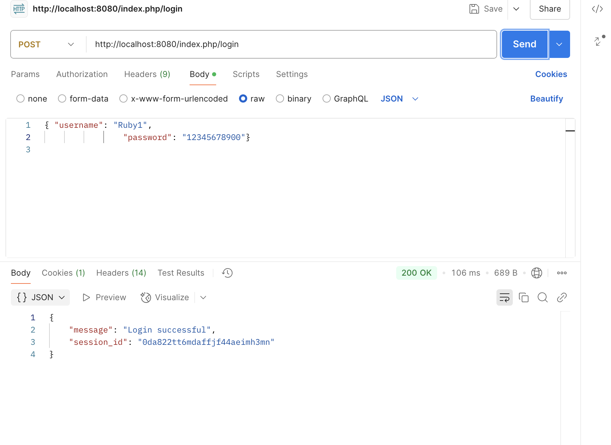

# DancingQueensMobile
The dancing queens is coming to iOS and android near you!
Work Division: Yenta 35%/Ruby 35%/Sage 30%


## To Set Up Environment

### XAMPP
- First, place the contents of the RESTAPI folder into your htdocs folder in XAMPP and start your servers.
- In MySQL, create a database titled mobile-app-db, then add two tables two it with the following queries:

    ```
    CREATE TABLE users (
    username VARCHAR(255) NOT NULL,
    password VARCHAR(255) NOT NULL,
    UNIQUE (username),
    PRIMARY KEY(username)
    )ENGINE=InnoDB DEFAULT CHARSET=utf8mb4 COLLATE=utf8mb4_unicode_ci;

    CREATE TABLE bookings (
    booking_id INT(11) AUTO_INCREMENT PRIMARY KEY,
    username VARCHAR(255),
    date DATE NOT NULL,
    time TIME NOT NULL,
    dancers VARCHAR(18),
     FOREIGN KEY (username) REFERENCES users(username) ON DELETE CASCADE ON UPDATE CASCADE
    ) ENGINE=InnoDB DEFAULT CHARSET=utf8mb4 COLLATE=utf8mb4_unicode_ci;
    ```


### Rest API Queries (Can be used in Postman or JS)
- Create account:
    Endpoint: POST  http://localhost:8080/index.php/user/create
    Body: { "username": "new_user2",
                      "password": "ruby"}
    Messages: 
        If account created successfully:
            {   "message": "User created successfully"}
        If missing user/pass:
            {  "error": "Username and password are required."}
        If username is already taken: 
            {"error": "Duplicate entry 'new_user2' for key 'PRIMARY'"}
- Login:
    Endpoint: POST http://localhost:8080/index.php/login
    Body: { "username": "new_user2",
            "password": "ruby"}
- Create a new booking: (must be logged in)
    Endpoint: POST http://localhost:8080/index.php/booking/create
    {  "date": "2027-07-30",
       "time": "14:30:00",
       "dancers": "yenta"}
- Modify booking: (must be logged in, users can only modify their own bookings, booking id must exist) 
    Endpoint: PUT http://localhost:8080/index.php/booking/update
    {  "booking_id": "1",
       "date": "2027-07-30",
       "time": "14:30:00",
       "dancers": "yenta"}
- Delete Booking: (must be logged in, users can only modify their own bookings, booking id must exist) 
    Endpoint: DELETE http://localhost:8080/index.php/booking/delete
	{  "booking_id": "1"}
- List the bookings: (must be logged in)
    Endpoint: GET http://localhost:8080/index.php/booking/list?limit=20. Note: we specify a limit (we dont want to list 1000 bookings)
 	No body


### Running the ios simulator
To run our app using your already downloaded ios simulator do the following once you have set up your local backend
- clone this repository on to your computer using the following command

  ```Git clone https://github.com/RubyFri/DancingQueensMobile.git```
  
- Navigate to the Dancing Queens directory using the following commands

  ```cd DancingQueensMobile/DancingQueens/```
  
- install npm to get all of the relevant Node.js packages

   ```npm install```
  
- Finally start the ios simulator

   ```npx expo start --ios```

This should begin the ios simulation!

Please feel free to create an account and log in to view the CRUD functionality. 

The user can create bookings (Create)

All bookings of all users are listed once the user logs in. (Read)

The user can modify bookings that they have created (Update)

The user can delete bookings that they have created (Delete)


### Notes on Use
- Access to CRUD functionality is through the Login Landing page, available once you have created an account and logged in
- When choosing dancers during Create or Modify Booking, remember to tap elsewhere on the page to close the MultiPicker before pressing the button


## Screenshots
- Sage's XAMPP still does not allow for MySQL, so her queries would not work, but she set up Postman anyway






